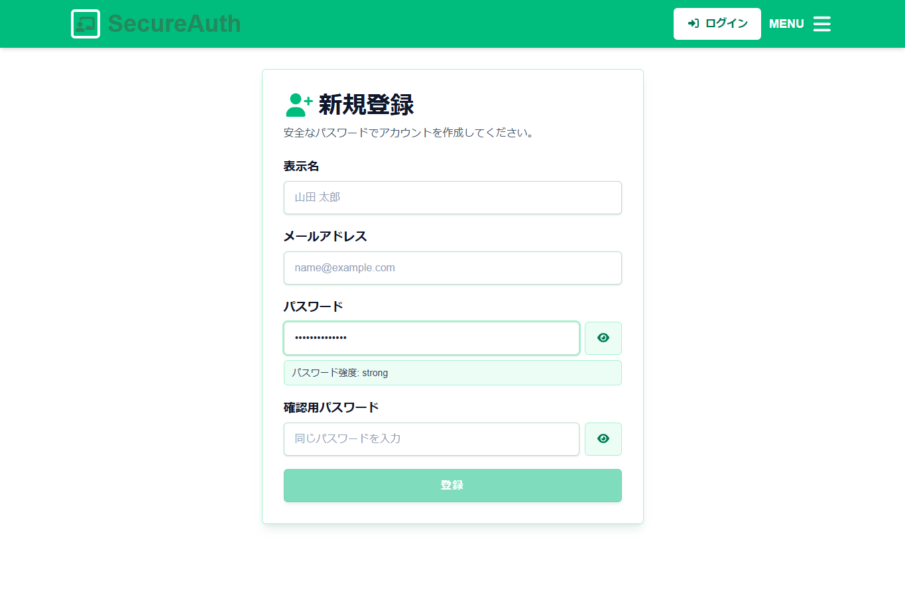
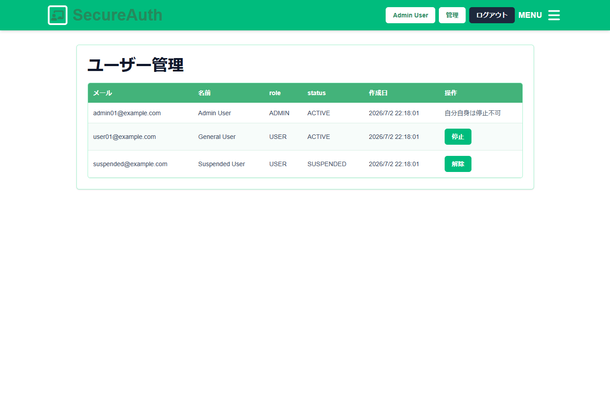

# セキュア認証・認可アプリ


## 実装した認証・認可機能

- 新規登録
- ログイン
- ログアウト
- セッション管理
- 管理者専用ページ
- ユーザー停止・停止解除
- 停止アカウントのログイン拒否
- ログイン履歴表示

## 教材にない追加機能

- ログイン試行のレートリミット
- サインアップ時の確認用パスワード
- サインアップ時のパスワード強度表示
- パスワード表示・非表示切り替え
- パスワード変更
- ログイン履歴表示
- 管理者によるユーザー一覧・停止・解除
- 独自機能「アカウント防御レベル」

## 独自機能: アカウント防御レベル

ログイン中のユーザーに、自分のアカウントの安全状態を 100 点満点の信用スコアとして表示します。表示場所は `/dashboard` です。

表示例:

```txt
アカウント防御レベル: 82 / 100
評価: Excellent
```

この機能により、ユーザーは以下を確認できます。

- パスワードが十分に強いか
- 最近ログイン失敗が多くないか
- 不要なセッションが残っていないか
- パスワード変更が長期間行われていないか
- アカウント状態が正常か

### 信用スコア計算方法

| 条件 | 点数 |
| --- | ---: |
| パスワード強度が strong | +25 |
| パスワード強度が medium | +15 |
| 直近7日間にログイン失敗がない | +20 |
| 直近7日間のログイン失敗が1から2回 | +10 |
| ログイン履歴を確認できる | +10 |
| アクティブセッションが1件 | +15 |
| アクティブセッションが2から3件 | +8 |
| パスワードを30日以内に変更済み | +15 |
| アカウント状態が ACTIVE | +15 |

合計が100点を超える場合は100点に丸めます。

### 評価区分

| 信用スコア | 表示 |
| ---: | --- |
| 80から100 | Excellent |
| 60から79 | Good |
| 40から59 | Needs Attention |
| 0から39 | Weak |

### 改善提案

信用スコアが低い場合、具体的な改善提案を表示します。

- パスワードを12文字以上に変更する
- 英大文字・英小文字・数字・記号を含める
- ログイン履歴に心当たりのない試行がないか確認する
- 不要なセッションをログアウトする
- パスワードを定期的に変更する

### パスワード強度の保存方針

パスワードは bcrypt でハッシュ化して保存し、平文パスワードは保存しません。そのため、パスワード強度は登録時またはパスワード変更時に判定し、判定結果だけを `passwordStrength` として保存します。

`users` テーブルには以下を追加しています。

| カラム | 内容 |
| --- | --- |
| passwordStrength | weak / medium / strong |
| passwordUpdatedAt | パスワード更新日時 |

## 画面画像

### 1. アカウント防御レベルを表示したダッシュボード


### 2. 信用スコア内訳


### 3. 改善提案


### 4. 新規登録のパスワード強度表示



### 5. 管理者によるユーザー管理



## 主要ページ

| パス | 内容 |
| --- | --- |
| `/signup` | 新規登録、確認用パスワード、強度表示、表示切り替え |
| `/login` | ログイン、レートリミット |
| `/dashboard` | ログイン中ユーザー情報、アカウント防御レベル |
| `/login-history` | ログイン成功・失敗履歴 |
| `/settings/password` | パスワード変更 |
| `/admin/users` | 管理者用ユーザー一覧、停止、解除 |
| `/member/about` | ログインユーザー用プロフィール編集 |

## DB設計

### users

- `id`
- `email`
- `passwordHash`
- `passwordStrength`
- `passwordUpdatedAt`
- `name`
- `role`
- `status`
- `aboutSlug`
- `aboutContent`
- `createdAt`
- `updatedAt`
- `lastLoginAt`

### sessions

- `id`
- `userId`
- `sessionTokenHash`
- `userAgent`
- `ipAddress`
- `expiresAt`
- `createdAt`
- `revokedAt`

### login_history

- `id`
- `userId`
- `email`
- `ipAddress`
- `userAgent`
- `success`
- `reason`
- `createdAt`

## セキュリティ対策

| 脅威・要件 | 対策 |
| --- | --- |
| パスワード漏えい | bcrypt でハッシュ化 |
| 平文パスワード保存 | 保存しない。強度判定結果だけ保存 |
| ブルートフォース攻撃 | ログイン失敗回数によるレートリミット |
| Cookie 盗取時の影響 | Cookieには生トークン、DBにはSHA-256ハッシュのみ保存 |
| XSS | CSP、公開プロフィール表示時の DOMPurify サニタイズ |
| CSRF | SameSite=Lax |
| 権限外アクセス | role による管理者ページ制御 |
| 停止ユーザーの利用 | status によるログイン拒否 |
| セッション残存 | ログアウト時に DB セッションへ `revokedAt` を記録 |
| 不審ログイン | ログイン履歴に成功・失敗・理由を記録 |

Next.js の実行に必要な初期化スクリプトとスタイルのため、CSP の `script-src` と `style-src` では `'unsafe-inline'` を許可しています。一方で、`object-src 'none'`、`frame-ancestors 'none'`、`base-uri 'self'`、`form-action 'self'` を設定し、不要な埋め込みや送信先を制限しています。

## セットアップ

```bash
npm i
```

`.env` を作成します。

```env
DATABASE_URL="file:./app.db"
```

DB を反映し、Prisma Client を生成し、初期データを投入します。

```bash
npx prisma db push
npx prisma generate
npx prisma db seed
```

開発サーバーを起動します。

```bash
npm run dev
```

PowerShell の実行ポリシーで `npx` や `npm` が止まる場合は、`npx.cmd`、`npm.cmd` を使ってください。

## テストユーザー

| role | status | email | password |
| --- | --- | --- | --- |
| ADMIN | ACTIVE | admin01@example.com | AdminPass1111! |
| USER | ACTIVE | user01@example.com | UserPass1111! |
| USER | SUSPENDED | suspended@example.com | StopPass1111! |

## 動作確認

```bash
npm run lint
npm run build
```
