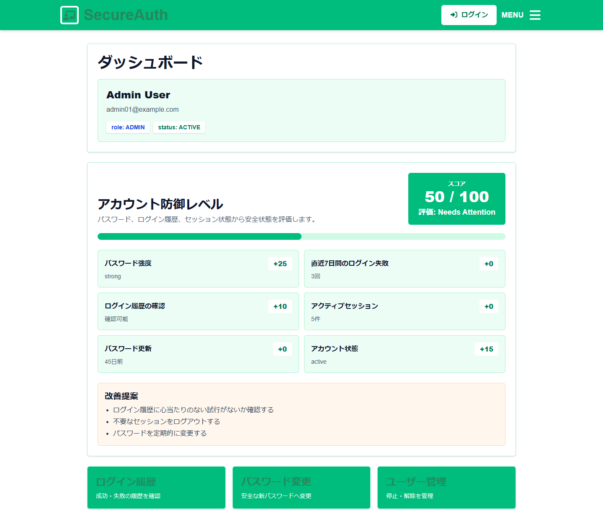
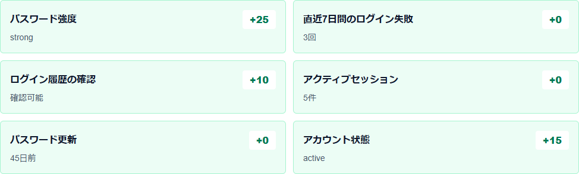
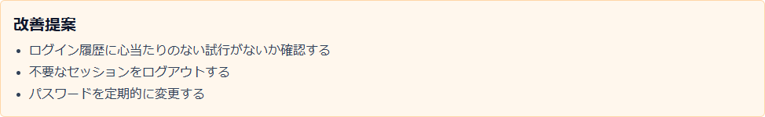

# セキュア認証・認可アプリ

Next.js と Prisma を使った、セッションベース認証の学習用アプリです。JWT は使わず、DB 管理のセッションと HttpOnly Cookie でログイン状態を扱います。

## 主な実装内容

- 新規登録: メールアドレス、パスワード、確認用パスワードを検証
- パスワード保護: bcrypt でハッシュ化して保存
- ログイン: bcrypt.compare で照合
- セッション認証: Cookie には生トークン、DB には SHA-256 ハッシュを保存
- Cookie 属性: HttpOnly、SameSite=Lax、Path=/、Max-Age、production 時 Secure
- ログアウト: DB セッションに revokedAt を設定し、Cookie を削除
- 認可: role による admin/user 制御
- アカウント状態: status による active/suspended 制御
- ログイン履歴: 成功、失敗、停止、レート制限を記録
- レート制限: 5分間に5回失敗したメールまたはIPを一時的に制限
- パスワード変更: 現在のパスワード確認、新パスワード確認、再ハッシュ化
- CSP: Next.js headers で Content-Security-Policy を設定
- 独自機能: アカウント防御レベル

## 独自機能: アカウント防御レベル

ログイン中のユーザーが、自分のアカウントの安全状態をスコアとして確認できる機能です。`/dashboard` に表示されます。

この機能により、ユーザーは次の状態を直感的に把握できます。

- パスワードが十分に強いか
- 最近ログイン失敗が多くないか
- 不要なセッションが残っていないか
- パスワード変更が長期間行われていないか
- アカウント状態が正常か

### スコア計算方法

| 条件 | 点数 |
| --- | ---: |
| パスワード強度が strong | +25 |
| パスワード強度が medium | +15 |
| 直近7日間にログイン失敗がない | +20 |
| 直近7日間のログイン失敗が1から2回 | +10 |
| ログイン履歴を確認できる | +10 |
| アクティブセッションが1件 | +15 |
| アクティブセッションが2から3件 | +8 |
| パスワードを30日以内に変更済み | +15 |
| アカウント状態が active | +15 |

合計が100点を超える場合は100点に丸めます。

### 評価区分

| スコア | 表示 |
| ---: | --- |
| 80から100 | Excellent |
| 60から79 | Good |
| 40から59 | Needs Attention |
| 0から39 | Weak |

### 改善提案

スコアが低い場合、次のような具体的な改善提案を表示します。

- パスワードを12文字以上に変更する
- 英大文字・英小文字・数字・記号を含める
- ログイン履歴に心当たりのない試行がないか確認する
- 不要なセッションをログアウトする
- パスワードを定期的に変更する

### パスワード強度の保存方針

パスワードは bcrypt でハッシュ化して保存し、平文パスワードは保存しません。そのため、パスワード強度は登録時またはパスワード変更時に判定し、判定結果だけを `passwordStrength` として保存します。

`users` テーブルには次の項目を追加しています。

| カラム | 内容 |
| --- | --- |
| passwordStrength | weak / medium / strong |
| passwordUpdatedAt | パスワード更新日時 |

### 画面イメージ

#### アカウント防御レベルが表示されたダッシュボード



#### スコア内訳の表示



#### 改善提案が表示されている画面



## 画面

- `/signup`: 新規登録
- `/login`: ログイン
- `/dashboard`: ログイン後のメインページ、アカウント防御レベル表示
- `/login-history`: ログイン履歴
- `/settings/password`: パスワード変更
- `/admin/users`: 管理者用ユーザー一覧、停止、解除
- `/member/about`: 公開プロフィール編集

## DB設計

### users

- `id`
- `email`
- `passwordHash`
- `passwordStrength`
- `passwordUpdatedAt`
- `name`
- `role`
- `status`
- `createdAt`
- `updatedAt`
- `lastLoginAt`

### sessions

- `id`
- `userId`
- `sessionTokenHash`
- `userAgent`
- `ipAddress`
- `expiresAt`
- `createdAt`
- `revokedAt`

### login_history

- `id`
- `userId`
- `email`
- `ipAddress`
- `userAgent`
- `success`
- `reason`
- `createdAt`

## セキュリティ対策一覧

| 脅威 | 対策 |
| --- | --- |
| パスワード漏洩 | bcrypt でハッシュ化 |
| ブルートフォース攻撃 | ログイン失敗回数によるレート制限 |
| 弱いパスワード | クライアント側表示とサーバー側検証 |
| Cookie 窃取 | HttpOnly Cookie |
| CSRF | SameSite=Lax |
| XSS 被害拡大 | CSP |
| 権限外アクセス | role による認可 |
| 停止アカウント悪用 | status によるログイン拒否 |
| セッション残存 | ログアウト時にDBセッションを失効 |
| 不審ログインの発見 | ログイン履歴表示 |

## セットアップ

```bash
npm i
```

`.env` を作成します。

```env
DATABASE_URL="file:./app.db"
```

DB を反映し、初期データを投入します。

```bash
npx prisma db push
npx prisma generate
npx prisma db seed
```

開発サーバーを起動します。

```bash
npm run dev
```

## テストユーザー

| role | status | email | password |
| --- | --- | --- | --- |
| ADMIN | ACTIVE | admin01@example.com | AdminPass1111! |
| USER | ACTIVE | user01@example.com | UserPass1111! |
| USER | SUSPENDED | suspended@example.com | StopPass1111! |

## 動作確認

```bash
npm run lint
npm run build
```

PowerShell の実行ポリシーで `npx` や `npm` が止まる場合は、`npx.cmd`、`npm.cmd` を使ってください。

## 実装上の注意

- セッションCookieの `Secure` は production でのみ有効にしています。localhost の開発環境でも動作確認できるようにするためです。
- Next.js の初期化スクリプトとスタイル都合で CSP の `script-src` と `style-src` に `'unsafe-inline'` を許可しています。
- 公開リポジトリに `.env`、DB、APIキー、本番パスワード、個人情報を含めないでください。
- JWT 関連コードは削除し、セッションベース認証に統一しています。
